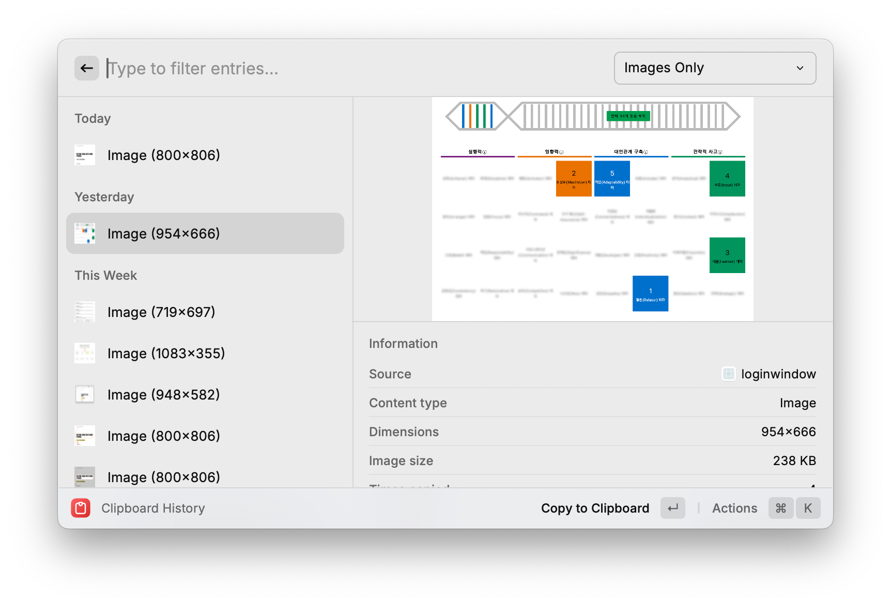
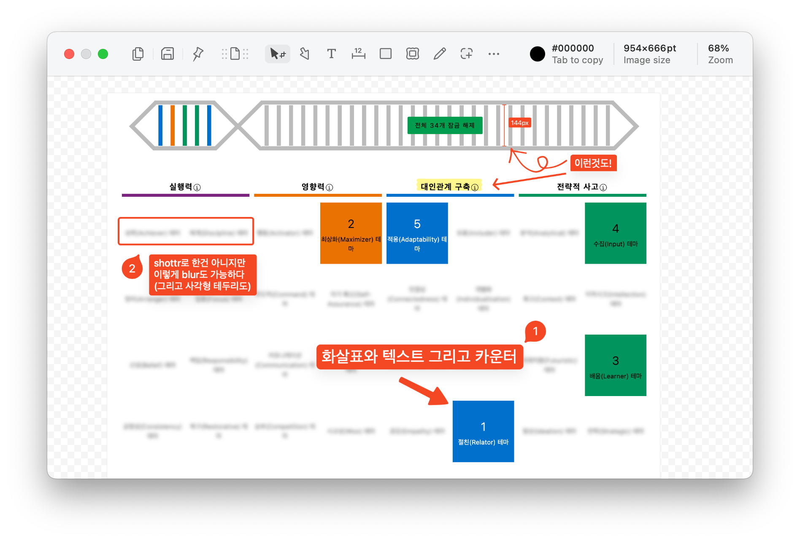
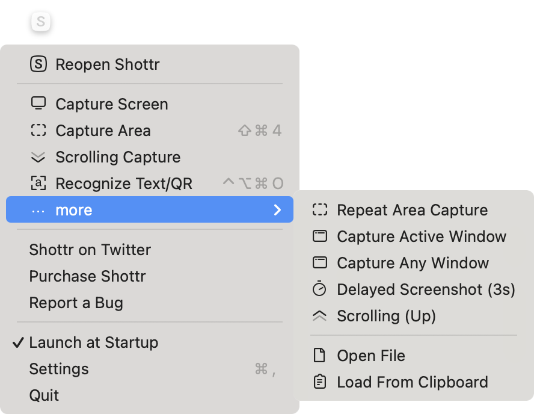
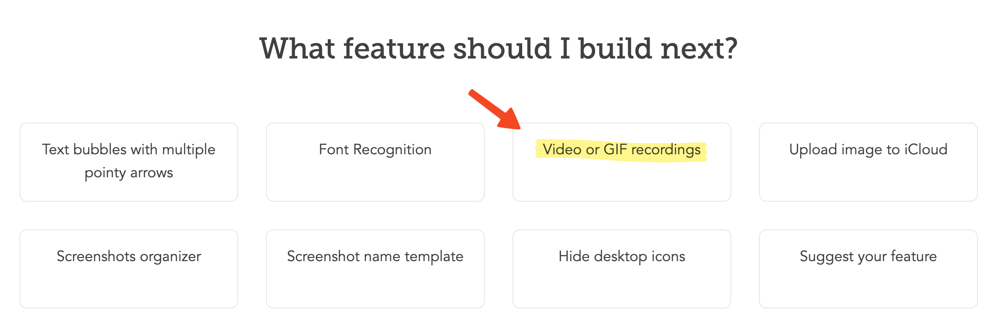

When writing documents in Notion or using communication tools like Slack, you find yourself needing to attach and share images all the time. As a backend developer, I often find myself needing to capture and share things beyond just code — diagrams drawn in Figma or [Excalidraw](https://excalidraw.com/), terminal output, SQL queries and results, server error logs, and monitoring tool dashboards like Datadog or Grafana. For a long time I relied on the default screenshot shortcuts for all of this, until I came across **[shottr](https://shottr.cc/)** on [GeekNews](https://news.hada.io/topic?id=6977). Since then I've settled on it as my go-to, and I've found it consistently useful — so I'd like to take this opportunity to introduce it.

> For what it's worth, shottr has continued to be recommended in threads like [Tell me your daily-use recommended macOS apps](https://news.hada.io/topic?id=15295) and [Any utilities you find useful that people around you don't use much? (2023)](https://news.hada.io/topic?id=12460), and a number of people I know have been happily using it as well.

## How I Usually Took Screenshots

macOS provides the following shortcuts by default:
- <kbd>⌘</kbd>command+<kbd>⇧</kbd>shift+<kbd>3</kbd>: Save full screen to file
- <kbd>⌘</kbd>+<kbd>⇧</kbd>+<kbd>4</kbd>: Save selected area to file

### Tips Worth a Few Minutes to Learn

Even if you don't use a dedicated screenshot app like shottr, the following tips are handy to know.
- Adding <kbd>⌃</kbd>control to any of the shortcut combinations above **copies to clipboard** instead of saving to a file. This lets you paste immediately without having to hunt down the screenshot on your desktop.
  - For reference, on Windows you can copy a selected area to the clipboard with <kbd>⊞</kbd>+<kbd>⇧</kbd>+<kbd>s</kbd>
- While in <kbd>⌘</kbd>+<kbd>⇧</kbd>+<kbd>4</kbd> or <kbd>⌘</kbd>+<kbd>⌃</kbd>+<kbd>⇧</kbd>+<kbd>4</kbd> mode, pressing <kbd>space</kbd> activates the window picker so you can capture just the window you want.
- <kbd>⌘</kbd>+<kbd>⇧</kbd>+<kbd>5</kbd> lets you capture a fixed region with various options or record it as a video.
- Using [Raycast](https://www.raycast.com/)'s built-in [clipboard history](https://www.raycast.com/core-features/clipboard-history) feature (<kbd>⌘</kbd>+<kbd>⇧</kbd>+<kbd>v</kbd>), you can capture multiple screenshots to the clipboard and then paste them all in one go, as shown below.
  - 
- If you also install [clop](https://lowtechguys.com/clop/), an image optimizer, images copied to the clipboard are automatically compressed—a nice bonus.

These built-in features work well enough for capturing and sharing specific areas, but they fall short when you want to draw attention to a particular region or annotate an image with additional text. Editing screenshots through Keynote or another image editor every time is a hassle—and that's exactly the gap shottr fills, with remarkably smooth usability.

## Shottr Interface and Use Cases

- Looking at the [introduction on the app's homepage](https://shottr.cc/#section-about), there are quite a few features, but the ones shown in the screenshot above are what you'll end up using most.
- After editing, the resulting image can be saved as a file, copied to clipboard, or pinned to float on screen.
- The usability is excellent—the keyboard shortcuts in particular are very intuitive.
  - To add an arrowarrow to an image, press <kbd>a</kbd>
  - A rectanglerectangle is <kbd>r</kbd>
  - And blur effectblur is <kbd>b</kbd>
- From the menu bar, you can also do scrolling capture and delayed capture, and even load an image from the clipboard to edit.
  - Delayed capture is especially handy for capturing monitoring dashboards or tooltips that disappear the moment you move the cursor away.
  - 
- It can also recognize QR codes and perform OCR on English and Korean text, though I haven't had much occasion to use those features actively.
- Most of the useful functionality is available for **free**, with only 2 features behind a paywall.
  - The "backdrop" feature adds a nice background around your captured screenshot. Personally, I haven't felt the need for it yet.
  - Merging multiple captures is a paid feature. I do find myself needing it occasionally, so I'm considering upgrading to paid just for that alone.

## Limitations
Shottr is excellent for capturing images, but it does not yet support GIF or video capture.

That said, the developer is aware of this gap, so we can look forward to support being added in a future update.

## Other Screenshot Tools
- [CleanShot X](https://cleanshot.com/): A true superset of shottr, offering a much richer feature set—precision capture, mouse pointer capture, keystroke capture, cloud upload with permalinks, and various text formats, among others. That said, it's paid by default, and I wasn't confident I'd actually use all those features, so I never tried it.
- [iShot](https://www.better365.info/ishot.html): A tool I used briefly before discovering shottr. It had plenty of features, but the UI and keyboard shortcuts weren't particularly intuitive, and the aesthetics and usability left something to be desired—so I stopped using it pretty quickly.
- [Xnapper](https://xnapper.com/ko): As polished as CleanShot X, but I only came across it after I was already well-settled with shottr, so I never felt the need to give it a try.

## Final Verdict
It may have a lower ceiling compared to other screenshot apps, but it's a tool that delivers satisfying results through its ease of use and default options alone. If you've never tried other tools, I'd recommend shottr—it's free and perfectly usable for life.