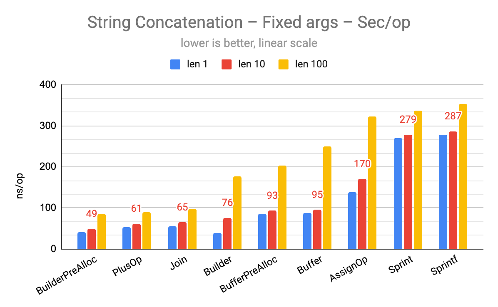
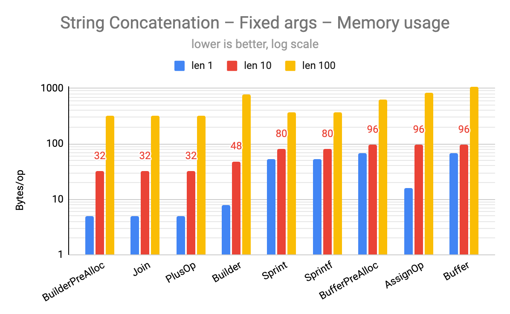
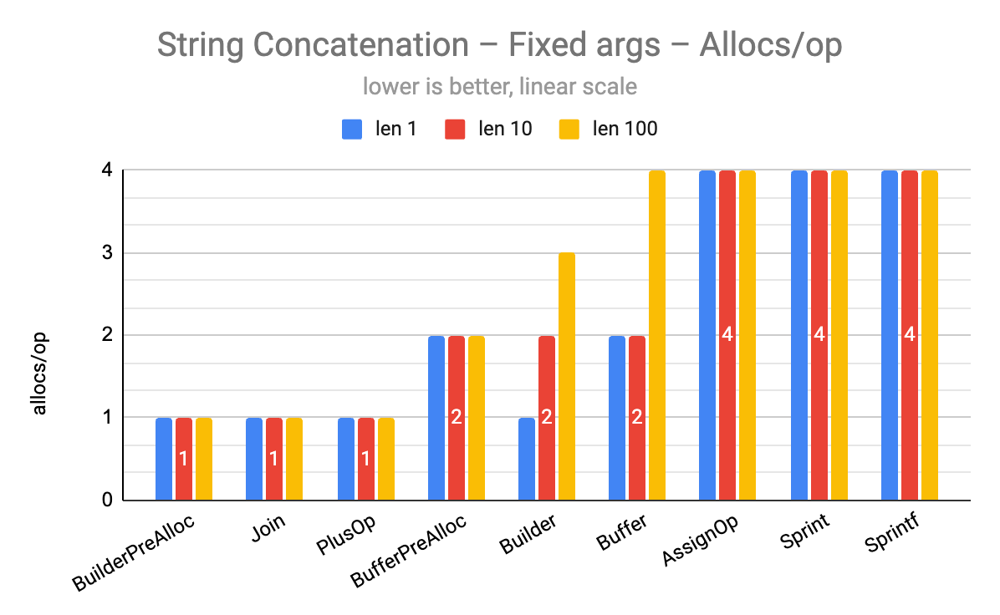
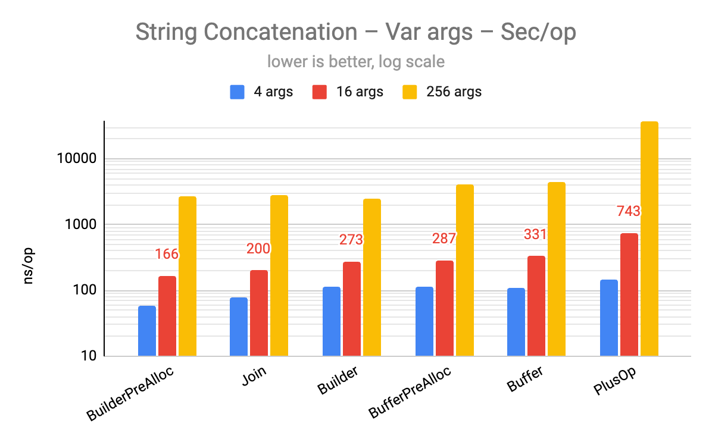
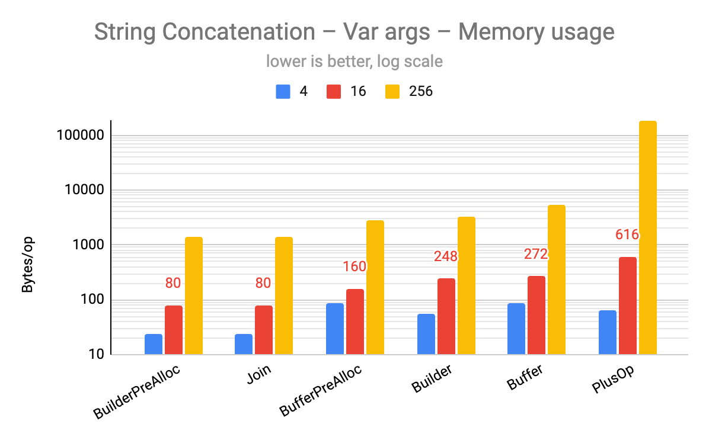
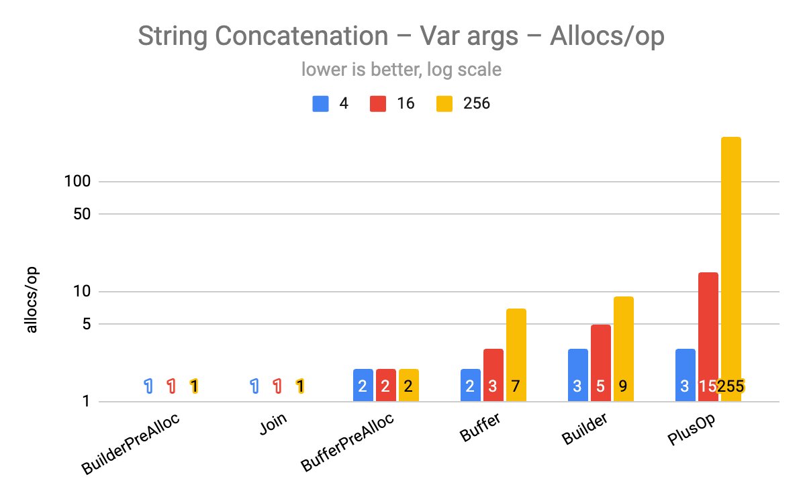

When working with Go, you often need to concatenate strings — whether building a cache key from struct fields, constructing a SQL query, or formatting strings for output. Whenever I did, I'd just reach for whatever I'd used out of habit: either a direct concatenation like `pk := row.ID + "#" + row.Name`, or a formatting function like `pk := fmt.Sprintf("%s#%s", row.ID, row.Name)`.

Honestly, part of me assumed that any approach would be fast enough, and if performance was a real concern for a frequently called piece of logic, I'd just throw together a quick micro-benchmark comparing a method or two and go with the faster one.

Eventually, though, I needed to squeeze out every bit I could — even from string concatenation — so I had to compare multiple approaches head-to-head. Thinking back over my use cases, they fell into two broad categories: the **fixed-argument scenario**, like building a cache key, where the number of inputs is known ahead of time, and the **variable-argument scenario**, where the number of inputs can change — such as assembling query conditions or working with values fetched from a store.

In this post, I use benchmarks to compare the performance and memory usage of various string concatenation methods across both scenarios.

## Methods to Compare

After narrowing down the approaches I've used from experience or that are widely known, I came up with roughly the following list.

1. `+` operator: Something I'd often reach for when the number of strings to concatenate is fixed.
2. `+=` operator: A method I haven't actually used all that much.
3. `fmt.Sprintf()`: I always had a vague sense it was slow, but I used it frequently because it tends to produce nicely aligned code.
4. `fmt.Sprint()`: Added as a comparison group to see whether the template interpolation in `fmt.Sprintf` is actually what makes it slow.
5. `strings.Join()`: Less a performance consideration, more that `Join` sometimes makes the code cleaner — so it was a personal preference.
6. `bytes.Buffer`: The pattern of creating a buffer and calling `WriteString` on it; you see this fairly often in library internals.
7. `strings.Builder`: Introduced in version 1.10 as a replacement for `bytes.Buffer`.
    - Both of the above have a `.Grow()` method internally that enables pre-allocation, so I tested each with and without it.

As a side note, when the total count is known ahead of time, it's generally recommended to pre-allocate slices or maps by setting the length or capacity upfront — for example, `ids := make([]string, len(users))`.
For more on this, see the [Banksalad Go Coding Convention – Setting len and cap when declaring a Slice](https://blog.banksalad.com/tech/go-best-practice-in-banksalad/#slice-선언-시-len-cap-설정) section I wrote previously, as well as the post [Known length slice initialization speed - Golang Benchmark Wednesday](https://simon-frey.com/blog/known-length-slice-initialization-speed-golang-benchmark-wednesday/).

## ⚡️ TL;DR

1. `strings.Builder` with the `.Grow()` method, or `strings.Join()`, is the fastest and most memory-efficient approach in all scenarios.
2. In fixed-argument scenarios, concatenating with `+` is also perfectly adequate.

## Function Implementations for Each Method

I've included the full source code as much as possible so anyone can reproduce the results.

### Fixed-Argument Scenario

```go
// concat.go
package concat

import (
	"bytes"
	"fmt"
	"strings"
)

const (
	delimiter = "#"
)

func FixedPlusOp(a, b, c string) string {
	return a + delimiter + b + delimiter + c
}
```

This is logic commonly implemented in fixed-argument scenarios.
For this test, I assumed a fixed case of 3 arguments — partly because that roughly reflects the average in my experience, and partly because increasing the number of arguments didn't significantly affect the relative benchmark results.

```go
func FixedAssignOp(a, b, c string) string {
	var s string
	s += a
	s += delimiter
	s += b
	s += delimiter
	s += c
	return s
}

func FixedSprintf(a, b, c string) string {
	return fmt.Sprintf("%s%s%s%s%s", a, delimiter, b, delimiter, c)
}

func FixedSprint(a, b, c string) string {
	return fmt.Sprint(a, delimiter, b, delimiter, c)
}

func FixedJoin(a, b, c string) string {
	return strings.Join([]string{a, b, c}, delimiter)
}

func FixedBuilder(a, b, c string) string {
	var builder strings.Builder
	builder.WriteString(a)
	builder.WriteString(delimiter)
	builder.WriteString(b)
	builder.WriteString(delimiter)
	builder.WriteString(c)
	return builder.String()
}

func FixedBuilderPreAlloc(a, b, c string) string {
	var builder strings.Builder
	builder.Grow(len(a) + len(b) + len(c) + len(delimiter)*2)
	builder.WriteString(a)
	builder.WriteString(delimiter)
	builder.WriteString(b)
	builder.WriteString(delimiter)
	builder.WriteString(c)
	return builder.String()
}
```

The `.Grow()` method allows you to pre-allocate the internal buffer capacity in advance.

```go
func FixedBuffer(a, b, c string) string {
	var buf bytes.Buffer
	buf.WriteString(a)
	buf.WriteString(delimiter)
	buf.WriteString(b)
	buf.WriteString(delimiter)
	buf.WriteString(c)
	return buf.String()
}

func FixedBufferPreAlloc(a, b, c string) string {
	var buf bytes.Buffer
	buf.Grow(len(a) + len(b) + len(c) + len(delimiter)*2)
	buf.WriteString(a)
	buf.WriteString(delimiter)
	buf.WriteString(b)
	buf.WriteString(delimiter)
	buf.WriteString(c)
	return buf.String()
}
```

### Variable-Argument Scenario

Unlike the fixed-argument scenario, there were fewer methods available for comparison.

```go
func VarPlusOp(ss []string) string {
	if len(ss) == 0 {
		return ""
	}

	result := ss[0]
	for _, s := range ss[1:] {
		result += delimiter + s
	}
	return result
}
```

In the variable-argument scenario, the distinction between the `+` operator and the `+=` operator becomes meaningless, so they were merged into a single function as shown above.
It could have been implemented as a [variadic function](https://gobyexample.com/variadic-functions), but since there's no meaningful difference, I went with a `[]string` parameter to avoid unnecessary conversions.

```go
func VarJoin(ss []string) string {
	return strings.Join(ss, delimiter)
}

func VarBuilder(ss []string) string {
	if len(ss) == 0 {
		return ""
	}

	var builder strings.Builder
	builder.WriteString(ss[0])
	for _, s := range ss[1:] {
		builder.WriteString(delimiter)
		builder.WriteString(s)
	}
	return builder.String()
}

const (
	delimiterLen = len(delimiter)
)

func VarBuilderPreAlloc(ss []string) string {
	if len(ss) == 0 {
		return ""
	}

	var length int
	for _, s := range ss {
		length += delimiterLen
		length += len(s)
	}

	var builder strings.Builder
	builder.Grow(length)

	builder.WriteString(ss[0])
	for _, s := range ss[1:] {
		builder.WriteString(delimiter)
		builder.WriteString(s)
	}
	return builder.String()
}
```

`.Grow()` requires knowing the total length upfront, so the code ends up looping twice.

```go
func VarBuffer(ss []string) string {
	if len(ss) == 0 {
		return ""
	}

	var buf bytes.Buffer
	buf.WriteString(ss[0])
	for _, s := range ss[1:] {
		buf.WriteString(delimiter)
		buf.WriteString(s)
	}
	return buf.String()
}

func VarBufferPreAlloc(ss []string) string {
	if len(ss) == 0 {
		return ""
	}

	var length int
	for _, s := range ss {
		length += delimiterLen
		length += len(s)
	}

	var buf bytes.Buffer
	buf.Grow(length)

	buf.WriteString(ss[0])
	for _, s := range ss[1:] {
		buf.WriteString(delimiter)
		buf.WriteString(s)
	}
	return buf.String()
}
```

## Benchmark Code

First, I verified that all functions produce identical results using the test below.

```go
// concat_test.go
package concat

import (
	"fmt"
	"math/rand/v2"
	"testing"

	"github.com/stretchr/testify/assert"
)

func TestAllFuncsAreSame(t *testing.T) {
	cases := []struct {
		a, b, c string
	}{
		{randString(1), randString(1), randString(1)},
		{randString(10), randString(10), randString(10)},
	}

	funcs := []func(a, b, c string) string{
		FixedPlusOp,
		FixedAssignOp,
		FixedSprintf,
		FixedSprint,
		FixedJoin,
		FixedBuilder,
		FixedBuffer,
		FixedBuilderPreAlloc,
		FixedBufferPreAlloc,
	}
	for _, tc := range cases {
		result := make([]string, len(funcs))
		for i, f := range funcs {
			result[i] = f(tc.a, tc.b, tc.c)
		}

		for i := range result {
			assert.Equal(t, result[0], result[i])
		}
	}
}

const charset = "abcdefghijklmnopqrstuvwxyzABCDEFGHIJKLMNOPQRSTUVWXYZ0123456789"

func randString(n int) string {
	b := make([]byte, n)
	for i := range b {
		b[i] = charset[rand.IntN(len(charset))]
	}
	return string(b)
}
```

```go
var result string

func BenchmarkFixed(b *testing.B) {
	funcs := []struct {
		name string
		do   func(a, b, c string) string
	}{
		{name: "PlusOp", do: FixedPlusOp},
		{name: "AssignOp", do: FixedAssignOp},
		{name: "Sprintf", do: FixedSprintf},
		{name: "Sprint", do: FixedSprint},
		{name: "Join", do: FixedJoin},
		{name: "Builder", do: FixedBuilder},
		{name: "Buffer", do: FixedBuffer},
		{name: "BuilderPreAlloc", do: FixedBuilderPreAlloc},
		{name: "BufferPreAlloc", do: FixedBufferPreAlloc},
	}

	cases := []struct {
		name    string
		a, b, c string
	}{
		{"1 length", randString(1), randString(1), randString(1)},
		{"10 length", randString(10), randString(10), randString(10)},
		{"100 length", randString(100), randString(100), randString(100)},
	}

	for _, tc := range cases {
		for _, f := range funcs {
			var r string
			b.Run(fmt.Sprintf("%s/%s", f.name, tc.name), func(b *testing.B) {
				b.ReportAllocs()
				b.ResetTimer()
				for i := 0; i < b.N; i++ {
					// escape compiler optimization
					r = f.do(tc.a, tc.b, tc.c)
				}
				b.StopTimer()
				result = r
			})
		}
	}
}
```

In most cases, the data to be passed as arguments is already prepared by the time string concatenation occurs, so the benchmark above excludes the time spent preparing the input data.
Also, if global variables and function return values aren't used appropriately, the compiler may arbitrarily optimize away the code at the compilation phase — which is why the benchmark is written the way it is. (See [Dave Cheney's 2013 post, How to write benchmarks in Go](https://dave.cheney.net/2013/06/30/how-to-write-benchmarks-in-go) for reference.)

```go
func BenchmarkVar(b *testing.B) {
	funcs := []struct {
		name string
		do   func([]string) string
	}{
		{name: "PlusOp", do: VarPlusOp},
		{name: "Join", do: VarJoin},
		{name: "Builder", do: VarBuilder},
		{name: "Buffer", do: VarBuffer},
		{name: "BuilderPreAlloc", do: VarBuilderPreAlloc},
		{name: "BufferPreAlloc", do: VarBufferPreAlloc},
	}

	cases := []struct {
		name string
		ss   []string
	}{
		{"4 args", randStringSlice(4)},
		{"16 args", randStringSlice(16)},
		{"256 args", randStringSlice(256)},
	}

	for _, tc := range cases {
		for _, f := range funcs {
			var r string
			b.Run(fmt.Sprintf("%s/%s", f.name, tc.name), func(b *testing.B) {
				b.ReportAllocs()
				b.ResetTimer()
				for i := 0; i < b.N; i++ {
					r = f.do(tc.ss)
				}
				b.StopTimer()
				result = r
			})
		}
	}
}

func randStringSlice(n int) []string {
	s := make([]string, n)
	for i := range s {
		s[i] = randString(rand.IntN(10))
	}
	return s
}
```

In variable-argument scenarios, I tested with progressively increasing argument counts, with each argument's length arbitrarily set to 10. This had no significant impact on the benchmark results.

## Benchmark

The benchmark was run on a local MacBook laptop using the command below.

```sh
$ system_profiler SPHardwareDataType
Hardware:
    Model Name: MacBook Air
    Chip: Apple M2
    Total Number of Cores: 8 (4 performance and 4 efficiency)
    Memory: 8 GB

$ go version
go version go1.22.5 darwin/arm64

$ go test -bench=^Benchmark$ -benchmem -cpu=1 -count=5 . | tee result.txt
$ benchstat result.txt
```

<details>
<summary>Result Raw Data</summary>

Fixed-argument scenario benchmark results

```sh
goos: darwin
goarch: arm64
pkg: playground/concat
                          │  result.txt  │
                          │    sec/op    │
Fixed/PlusOp/1              53.18n ±  0%
Fixed/AssignOp/1            138.0n ±  1%
Fixed/Sprintf/1             277.6n ±  1%
Fixed/Sprint/1              269.9n ±  0%
Fixed/Join/1                54.80n ±  1%
Fixed/Builder/1             39.70n ±  1%
Fixed/Buffer/1              88.43n ±  0%
Fixed/BuilderPreAlloc/1     40.41n ±  2%
Fixed/BufferPreAlloc/1      86.49n ±  0%
Fixed/PlusOp/10             61.40n ±  0%
Fixed/AssignOp/10           169.8n ±  0%
Fixed/Sprintf/10            286.8n ±  0%
Fixed/Sprint/10             278.6n ±  1%
Fixed/Join/10               65.14n ±  0%
Fixed/Builder/10            75.61n ±  0%
Fixed/Buffer/10             95.29n ±  0%
Fixed/BuilderPreAlloc/10    49.04n ±  0%
Fixed/BufferPreAlloc/10     93.21n ±  0%
Fixed/PlusOp/100            89.20n ±  0%
Fixed/AssignOp/100          249.7n ±  0%
Fixed/Sprintf/100           336.3n ±  0%
Fixed/Sprint/100            321.8n ±  0%
Fixed/Join/100              98.55n ±  2%
Fixed/Builder/100           203.6n ±  3%
Fixed/Buffer/100            352.6n ±  3%
Fixed/BuilderPreAlloc/100   86.54n ±  0%
Fixed/BufferPreAlloc/100    177.6n ± 19%
geomean                          121.0n

                           │  result.txt  │
                           │     B/op     │
Fixed/PlusOp/1                5.000 ± 0%
Fixed/AssignOp/1              16.00 ± 0%
Fixed/Sprintf/1               53.00 ± 0%
Fixed/Sprint/1                53.00 ± 0%
Fixed/Join/1                  5.000 ± 0%
Fixed/Builder/1               8.000 ± 0%
Fixed/Buffer/1                69.00 ± 0%
Fixed/BuilderPreAlloc/1       5.000 ± 0%
Fixed/BufferPreAlloc/1        69.00 ± 0%
Fixed/PlusOp/10               32.00 ± 0%
Fixed/AssignOp/10             96.00 ± 0%
Fixed/Sprintf/10              80.00 ± 0%
Fixed/Sprint/10               80.00 ± 0%
Fixed/Join/10                 32.00 ± 0%
Fixed/Builder/10              48.00 ± 0%
Fixed/Buffer/10               96.00 ± 0%
Fixed/BuilderPreAlloc/10      32.00 ± 0%
Fixed/BufferPreAlloc/10       96.00 ± 0%
Fixed/PlusOp/100              320.0 ± 0%
Fixed/AssignOp/100            848.0 ± 0%
Fixed/Sprintf/100             368.0 ± 0%
Fixed/Sprint/100              368.0 ± 0%
Fixed/Join/100                320.0 ± 0%
Fixed/Builder/100             784.0 ± 0%
Fixed/Buffer/100            1.078Ki ± 0%
Fixed/BuilderPreAlloc/100     320.0 ± 0%
Fixed/BufferPreAlloc/100      640.0 ± 0%
geomean                            81.48

                          │ result.txt │
                          │ allocs/op  │
Fixed/PlusOp/1              1.000 ± 0%
Fixed/AssignOp/1            4.000 ± 0%
Fixed/Sprintf/1             4.000 ± 0%
Fixed/Sprint/1              4.000 ± 0%
Fixed/Join/1                1.000 ± 0%
Fixed/Builder/1             1.000 ± 0%
Fixed/Buffer/1              2.000 ± 0%
Fixed/BuilderPreAlloc/1     1.000 ± 0%
Fixed/BufferPreAlloc/1      2.000 ± 0%
Fixed/PlusOp/10             1.000 ± 0%
Fixed/AssignOp/10           4.000 ± 0%
Fixed/Sprintf/10            4.000 ± 0%
Fixed/Sprint/10             4.000 ± 0%
Fixed/Join/10               1.000 ± 0%
Fixed/Builder/10            2.000 ± 0%
Fixed/Buffer/10             2.000 ± 0%
Fixed/BuilderPreAlloc/10    1.000 ± 0%
Fixed/BufferPreAlloc/10     2.000 ± 0%
Fixed/PlusOp/100            1.000 ± 0%
Fixed/AssignOp/100          4.000 ± 0%
Fixed/Sprintf/100           4.000 ± 0%
Fixed/Sprint/100            4.000 ± 0%
Fixed/Join/100              1.000 ± 0%
Fixed/Builder/100           3.000 ± 0%
Fixed/Buffer/100            4.000 ± 0%
Fixed/BuilderPreAlloc/100   1.000 ± 0%
Fixed/BufferPreAlloc/100    2.000 ± 0%
geomean                          2.030
```

Variable-argument benchmark results

```sh
goos: darwin
goarch: arm64
pkg: playground/concat
                          │ result_var.txt │
                          │     sec/op     │
Var/PlusOp/4                 145.3n ± 4%
Var/Join/4                   78.26n ± 1%
Var/Builder/4                115.4n ± 0%
Var/Buffer/4                 110.9n ± 0%
Var/BuilderPreAlloc/4        59.25n ± 0%
Var/BufferPreAlloc/4         112.6n ± 3%
Var/PlusOp/16                742.9n ± 0%
Var/Join/16                  199.7n ± 3%
Var/Builder/16               273.1n ± 3%
Var/Buffer/16                331.2n ± 1%
Var/BuilderPreAlloc/16       165.7n ± 6%
Var/BufferPreAlloc/16        287.4n ± 1%
Var/PlusOp/256               37.34µ ± 0%
Var/Join/256                 2.810µ ± 1%
Var/Builder/256              2.490µ ± 2%
Var/Buffer/256               4.471µ ± 2%
Var/BuilderPreAlloc/256      2.638µ ± 1%
Var/BufferPreAlloc/256       4.119µ ± 1%
geomean                           520.5n

                          │ result_var.txt │
                          │      B/op      │
Var/PlusOp/4                  64.00 ± 0%
Var/Join/4                    24.00 ± 0%
Var/Builder/4                 56.00 ± 0%
Var/Buffer/4                  88.00 ± 0%
Var/BuilderPreAlloc/4         24.00 ± 0%
Var/BufferPreAlloc/4          88.00 ± 0%
Var/PlusOp/16                 616.0 ± 0%
Var/Join/16                   80.00 ± 0%
Var/Builder/16                248.0 ± 0%
Var/Buffer/16                 272.0 ± 0%
Var/BuilderPreAlloc/16        80.00 ± 0%
Var/BufferPreAlloc/16         160.0 ± 0%
Var/PlusOp/256              185.6Ki ± 0%
Var/Join/256                1.375Ki ± 0%
Var/Builder/256             3.242Ki ± 0%
Var/Buffer/256              5.312Ki ± 0%
Var/BuilderPreAlloc/256     1.375Ki ± 0%
Var/BufferPreAlloc/256      2.750Ki ± 0%
geomean                            364.7

                           │ result_var.txt │
                           │   allocs/op    │
Var/PlusOp/4                  3.000 ± 0%
Var/Join/4                    1.000 ± 0%
Var/Builder/4                 3.000 ± 0%
Var/Buffer/4                  2.000 ± 0%
Var/BuilderPreAlloc/4         1.000 ± 0%
Var/BufferPreAlloc/4          2.000 ± 0%
Var/PlusOp/16                 15.00 ± 0%
Var/Join/16                   1.000 ± 0%
Var/Builder/16                5.000 ± 0%
Var/Buffer/16                 3.000 ± 0%
Var/BuilderPreAlloc/16        1.000 ± 0%
Var/BufferPreAlloc/16         2.000 ± 0%
Var/PlusOp/256                255.0 ± 0%
Var/Join/256                  1.000 ± 0%
Var/Builder/256               9.000 ± 0%
Var/Buffer/256                7.000 ± 0%
Var/BuilderPreAlloc/256       1.000 ± 0%
Var/BufferPreAlloc/256        2.000 ± 0%
geomean                            3.050
```

</details>

## Results

### Comparing Results with Graphs – Fixed Arguments



Execution times were sorted fastest to slowest across different argument lengths. The ranking was: pre-allocated `strings.Builder` > `+` operator > `strings.Join()`. The fastest method varied slightly depending on the length, but the results here are sorted by the length-10 case.



This is on a log scale. The same top three methods held their positions for memory usage, all with comparably low consumption.



For number of memory allocations, all three methods performed with minimal allocations regardless of the argument length.

### Comparing Results with Graphs – Variable Arguments



In execution time, pre-allocated `strings.Builder` and `strings.Join()` take the top 2 spots in that order.
Keeping in mind that this is on a log scale, the `+=` operator approach was essentially unusable.



The top 2 for memory usage were the same.



The same holds for number of memory allocations — and given the log scale, the inefficiency of the `+=` operator approach stands out clearly.

## Summary

To wrap up the results:

1. `strings.Builder` with pre-allocated capacity via the `.Grow()` method, or `strings.Join()`, was the fastest and most efficient approach in every scenario.
    - Surprisingly, `strings.Join()` turned out to be quite fast as well.
2. In fixed-argument scenarios, simply concatenating with `+` was more than adequate.
3. It would certainly be worthwhile to dig into *why* the slow methods are slow and the fast ones are fast — but that's a rabbit hole I'll let you enjoy on your own.

## Further Reading

* A 2024 post by [Max Hoffman](https://github.com/max-hoffman): [fmt.Sprintf vs String Concat](https://www.dolthub.com/blog/2024-11-08-sprintf-vs-concat/)
    * Explains why `fmt.Sprintf` is slow and `+` is fast.
* A post by [Brandur Leach](https://brandur.org): [Go's bytes.Buffer vs. strings.Builder](https://brandur.org/fragments/bytes-buffer-vs-strings-builder)
    * Compares the differences between `bytes.Buffer` and `strings.Builder`.